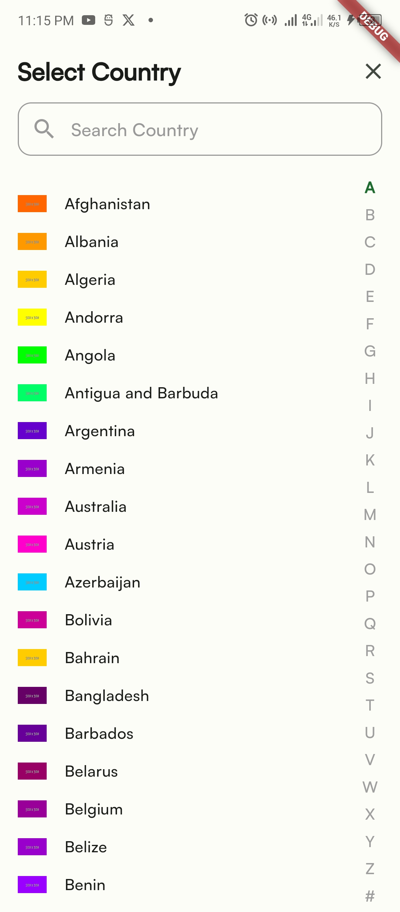

# intrapair_mobile_apt_test

## Task Description
During the test, I accomplished the following:

1. **UI Design**: Created three visually appealing and user-friendly screens for a mobile application. The design focused on aesthetics and usability, ensuring a seamless user experience.

2. **API Integration**: Successfully integrated an API that retrieves a comprehensive JSON list of all countries. This involved making network requests and handling the data efficiently.

3. **Search Functionality**: Implemented a robust search feature that allows users to search for specific countries from the retrieved list. The search functionality is optimized for quick and accurate results.

These tasks demonstrate my ability to design intuitive user interfaces, integrate external APIs, and implement essential application features effectively.

Here are screenshots of the project:

  
  
  

